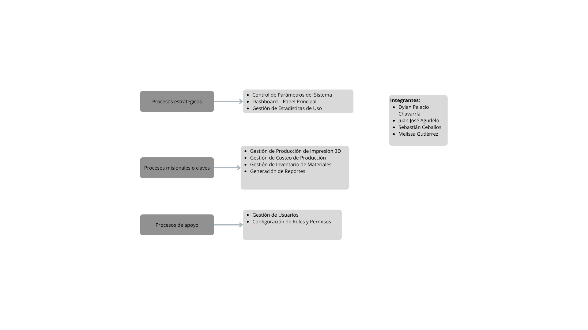

# Sistema de Gestión para Laboratorio de Impresión 3D 🖨️🤖

Caso de estudio de análisis arquitectónico, ingeniería de requisitos y modelado de procesos diseñado para centralizar y optimizar el control de producción, costeo de filamentos, consumos energéticos e inventario del laboratorio de fabricación digital del Centro de Formación SENA (Medellín, Antioquia).

## 📌 Contexto del Proyecto
Este proyecto aborda la problemática real de la gestión operativa de un entorno académico y tecnológico de manufactura aditiva. Actualmente, los registros de materiales consumidos, tiempos de uso de los equipos, costos por pieza, mantenimiento e ingresos se manejan de forma manual o descentralizada en hojas de cálculo aisladas. 

La solución planteada define la arquitectura conceptual de un software centralizado capaz de garantizar la seguridad, trazabilidad de la información y optimización de recursos bajo el enfoque ágil **Scrum**.

## 🛠️ Stack Tecnológico Proyectado
A partir del análisis de requerimientos se determinó la implementación de la siguiente arquitectura técnica:
* **Metodología de Desarrollo:** Agile / Scrum (Fases de Sprint Planning, Daily, Review y Retrospective).
* **Base de Datos:** Relacional (Diseñada para mitigar la redundancia de costos y piezas).
* **Seguridad de la Información:** Cumplimiento de la Ley 1581 de 2012 (Protección de datos personales en Colombia) y control de acceso basado en roles.

## 🗂️ Estructura del Repositorio
* `analisis_de_procesos/`: Contiene el modelado operativo fundamental del sistema.
  * 🖼️ `Mapa_de_procesos.png`: Diagrama visual que clasifica la operación del laboratorio en procesos estratégicos, misionales y de apoyo.
  * 📄 `ficha_caracterizacion_proceso.docx`: Ficha detallada con las entradas, salidas y las actividades del ciclo PHVA (Planear, Hacer, Verificar, Actuar) para el módulo de Roles y Permisos.
  * `documentos/`: 
    * 📄 `Ficha_de_Proyecto_ADSO_2026.docx`: Planteamiento formal del problema, justificación, árbol de objetivos y control metodológico de los aprendices.

## 📐 Modelado de Procesos del Negocio (BPMN/Operativo)

El sistema se estructura bajo la sinergia de los procesos de la organización, asegurando que el desarrollo de software responda directamente a las necesidades operativas de instructores, aprendices y personal administrativo:

### 1. Mapa de Procesos de la Organización
Mapeo global que vincula la gestión de calidad, la ingeniería ágil, el control de inventario de consumibles y el mantenimiento preventivo de las impresoras:

### 2. Caracterización Operativa del Sistema
El comportamiento funcional para el control de acceso y seguridad sigue una estructura PHVA rigurosa descrita formalmente en la documentación técnica de roles y permisos:
* **Estrategia (Planear):** Identificación de perfiles de usuario y asignación de restricciones lógicas por módulo del laboratorio.
* **Ejecución (Hacer):** Persistencia de nuevos roles con estados dinámicos (activo/inactivo) y asignación al usuario.
* **Auditoría (Verificar):** Validación de logs de acceso y coherencia de permisos en el entorno de fabricación.
* **Control (Actuar):** Ajuste de matrices de acceso y generación de informes consolidados de auditoría.

## 👥 Equipo de Investigación y Desarrollo (ADSO 2026)
* **Sebastián Ceballos Mazo** - lider del proyecto y Analista de Requisitos & Modelado de Procesos
* **Dylan Palacio Chavarría** - Analista Técnico
* **Juan José Agudelo Herrera** - Documentación y Gestión de Alcance
